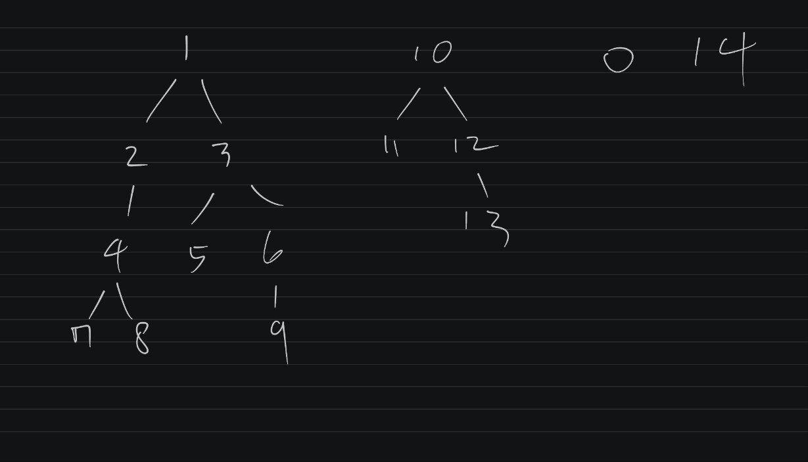

# Kotlin Spring Server - Category System
이 프로젝트는 Kotlin, Gradle, Spring Boot Webflux 를 사용한 서버 사이드 프로젝트입니다.

## Architecture
이 프로젝트는 Domain-Driven design(DDD) 을 기반으로 분리되어 Gradle 기반의 간소화 된 3가지 하위 프로젝트로 구성됩니다.
### [Domain](subproject/domain)
도메인은 외부 종속을 최소화 하여 순수한 Kotlin 코드로 비즈니스 로직을 구현하도록 노력 하였습니다.
### [Infrastructure](subproject/infrastructure)
인프라스트럭쳐에는 데이터베이스, 네트워크 및 라이브러리 같은 외부 종속성을 사용하는 도메인 인터페이스의 구현체가 있는 모듈입니다.
### [Presentation](subproject/presentation)
프리젠테이션은 도메인 기능을 네트워크 API 로 제공하며, 서비스를 실행할 수 있는 리소스가 포함되어 프로젝트에 DI 를 담당합니다.

## 기술 스택
```
H2 DB, Kotlin, Spring Boot, Spring Webflux, Spring Data R2DBC, Arrow either, Gradle
```

## 구현내용

 - 카테고리의 등록/수정/삭제 API 를 구현하였습니다.
 - 카테고리 조회 API 를 구현하였습니다.
   - ID 를 사용하여 해당 카테고리와 이하 하위 카테고리들을 조회할 수 있습니다.
   - ID 를 지정하지 않으면 전체 카테고리를 반환합니다.
 - 카테고리 간 부모-자식 관계를 연결할 수 있는 API 를 구현하였습니다.
 - Transaction rollback 처리를 추가하였습니다.
 - Unit Test 및 Integration Test 를 작성하였습니다. 

## 실행방법
```
./gradlew :subproject:presentation:bootRun;
```
JDK 17 기반으로 개발하였으며, Gradle 이 설치되어 있어야 합니다.   
IntelliJ IDE 내 AssignmentApplication.kt class 에서 직접 UI 로 실행할 수 있습니다. 

## Unit Test 및 Integration Test
단위 테스트, 인테그레이션 테스트, end-to-end 테스트를 구현하였습니다.
```
./gradlew test;
```
- Unit Test
  - [Service Test1](./subproject/domain/src/test/kotlin/com/assignment/ktserver/CategoryServiceSpec.kt)
  - [Service Test2](./subproject/infrastructure/src/test/kotlin/com/assignment/ktserver/CategoryQueryServiceSpec.kt)
- Integration Test
  - [Repository Test](./subproject/infrastructure/src/test/kotlin/com/assignment/ktserver/CategoryRepositorySpec.kt)   
- E2E Test
  - [EndToEnd Test](./subproject/presentation/src/test/kotlin/com/assignment/ktserver/EndToEndTest.kt)
  


### 실행시 Embedded H2 DB 에 DDL 로 테이블이 생성되며, 확인을 위한 샘플 데이터 DML 이 포함되어 있습니다.
- [DDL](./subproject/presentation/src/main/resources/schema.sql) 스키마 
- [DML](./subproject/presentation/src/main/resources/data.sql) 데이터  
- <details>
  <summary>DML Sample Categories Tree</summary>
  
  
  
  </details>

## API
* `GET /categories/{id}` : 특정 카테고리 조회 
  ```
  > curl -i -X GET http://localhost:8080/categories/existing-id
  HTTP/1.1 200 OK
  Content-Type: application/json; charset=UTF-8
  {"id":"some-id","parent_id":somd-parent-id,"name":"10","children":[{"id": ..}]}
  
  > curl -i -X GET http://localhost:8080/categories/non-existing-id
  HTTP/1.1 404 Not Found
  ```
* `GET /categories` : 모든 카테고리 조회
  ```
  > curl -i -X GET http://localhost:8080/categories
  HTTP/1.1 200 OK
  Content-Type: application/json; charset=UTF-8
  [{"id":"some-id","parent_id":somd-parent-id,"name":"10","children":[{"id": ..}]}, ..]
  
  > curl -i -X GET http://localhost:8080/categories
  HTTP/1.1 404 Not Found
  ```
* `POST /categories`: 카테고리 생성
  ```
  > curl -i -X POST http://localhost:8080/categories -H "Content-Type: application/json" -d '{ "name": "pants" }'
  HTTP/1.1 201 Created
  Location: /categories/8bf1etYkIcR8ZV93mkho6WVS8fyupJzN
  
  > curl -i -X POST http://localhost:8080/categories -H "Content-Type: application/json" -d '{ "name": "!@" }'
  HTTP/1.1 400 Bad Request
  Content-Type: text/plain; charset=UTF-8
  Category name must be alphanumeric.
  ```
* `POST /categories/relationships` : 카태고리 부모-자식 관계 추가
  ```
  > curl -i -X POST http://localhost:8080/categories/relationships -H "Content-Type: application/json" -d '{ "parent_id": "existing-parent-id", "id" : "existing-child-id" }'
  HTTP/1.1 204 No Content
  
  > curl -i -X POST http://localhost:8080/categories/relationships -H "Content-Type: application/json" -d '{ "parent_id": "non-exist-child-id", "id" : "non-exist-parent-id" }'
  HTTP/1.1 409 Conflict
  Content-Type: text/plain;charset=UTF-8
  Cannot register your own category or child category as a parent category.

  > curl -i -X POST http://localhost:8080/categories/relationships -H "Content-Type: application/json" -d '{ "parent_id": "non-exist-parent-id", "id" : "non-exist-child-id" }'
  HTTP/1.1 404 Not Found
  ```
* `PATCH /categories/{id}`: 카테고리 메타 데이터 갱신
  ```
  > curl -i -X PATCH http://localhost:8080/categories/existing-id -H "Content-Type: application/json" -d '{ "name": "padding" }'
  HTTP/1.1 204 No Content
  
  > curl -i -X PATCH http://localhost:8080/categories/non-existing-id -H "Content-Type: application/json" -d '{ "name": "padding" }'
  HTTP/1.1 404 Not Found

  > curl -i -X POST http://localhost:8080/categories/existing-id -H "Content-Type: application/json" -d '{ "name": "!@" }'
  HTTP/1.1 400 Bad Request
  Content-Type: text/plain; charset=UTF-8
  Category name must be alphanumeric.
  
  > curl -i -X POST http://localhost:8080/categories/non-existing-id -H "Content-Type: application/json" -d '{ "name": "outer" }'
  HTTP/1.1 404 Not Found
  ```
* `DELETE /categories/{id}` : 카테고리 리소스 삭제
  ```
  > curl -i -X DELETE http://localhost:8080/categories/existing-id
  HTTP/1.1 204 No Content
  
  > curl -i -X POST http://localhost:8080/categories/non-existing-id
  HTTP/1.1 404 Not Found
  ```
